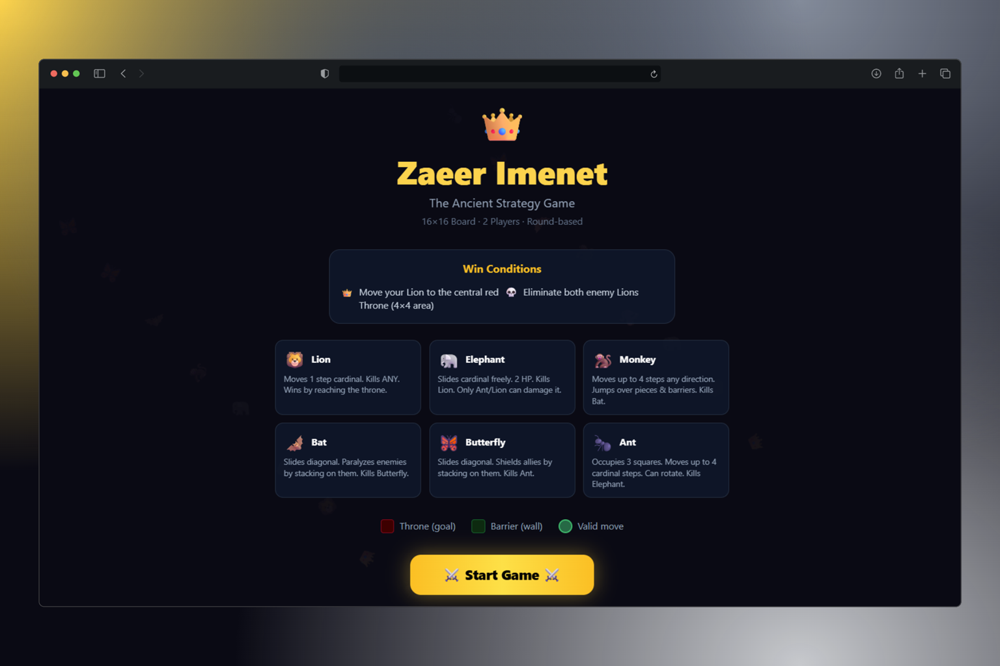
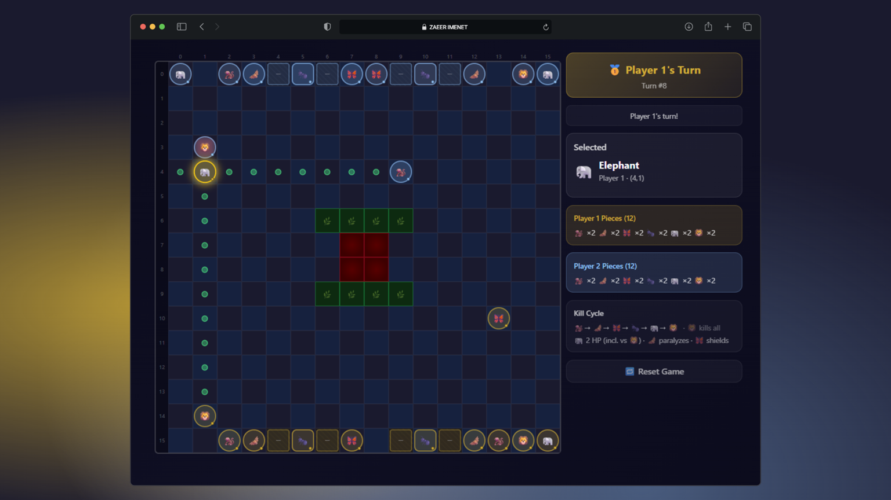
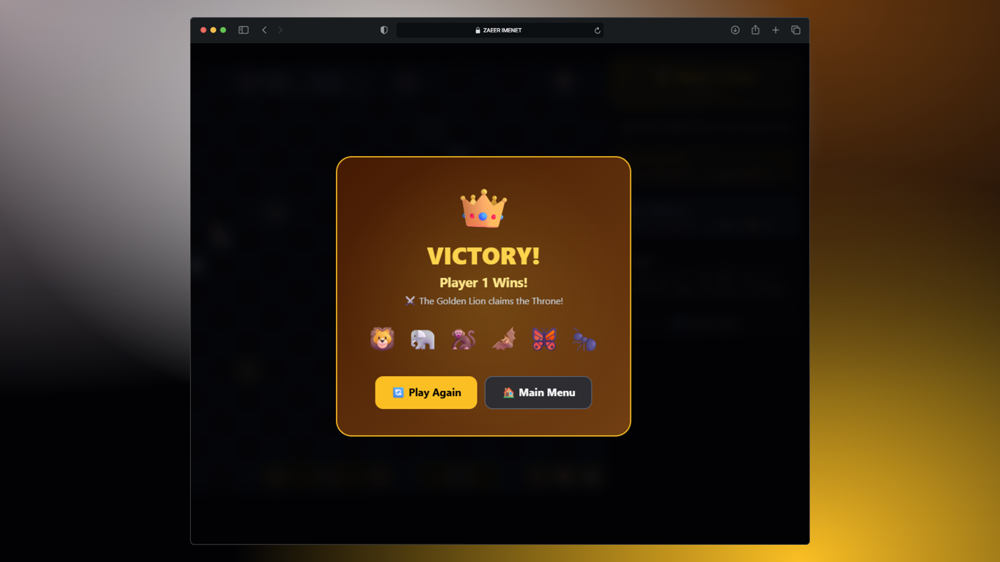
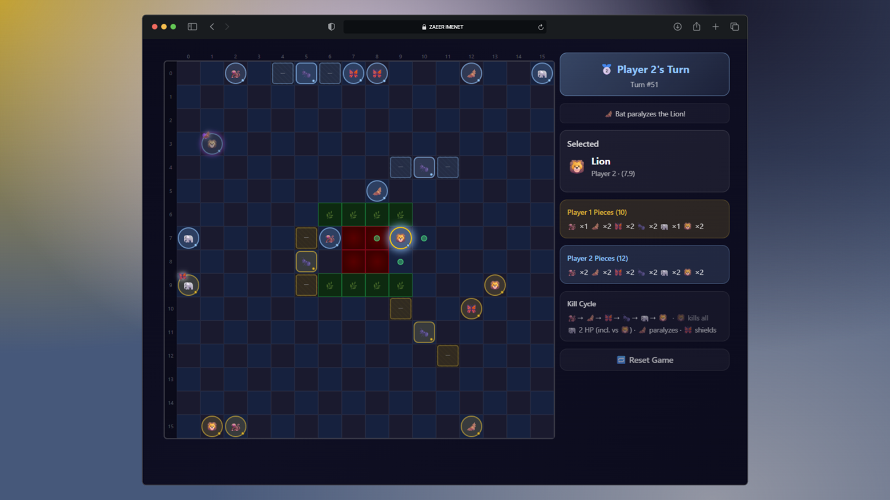

# Zaeer Imenet – Strategy Game

## Overview
Zaeer is an original turn-based strategy game built on a custom-designed system. The project combines game design, system architecture, and full-stack development into a single interactive platform.

The goal was to create a deterministic and balanced system where each piece has a defined role, interaction rules, and strategic value.

---

## Game Preview

---

## Game Concept
- Board: 16×16 grid  
- Players: 2  
- Pieces: 6 types (12 per player)  

Victory is achieved by:
- Eliminating both enemy Lions  
- Or reaching the central throne  

The system is based on a structured interaction model between pieces, where each unit has specific movement, behavior, and combat rules.

---

## Core Mechanics
- Life-cycle based combat system  
- Multi-tile pieces with rotation (Ant)  
- Layer mechanics (shielding, disabling)  
- Strategic positioning over randomness  
- Turn-based deterministic gameplay  

---

## Piece System
- Lion: Primary unit, direct elimination  
- Elephant: High durability, conditional attacks  
- Monkey: High mobility, can jump obstacles  
- Bat: Disables enemy pieces  
- Butterfly: Shields allies  
- Ant: Multi-cell piece with rotation mechanics  

---

## Technical Implementation

### Frontend
- React  
- TypeScript  
- Component-based architecture  
- State-driven UI  

### Backend
- Game state management  
- Turn system  
- Rule validation engine  

---

## Architecture Focus
- Separation between UI and game engine  
- Deterministic logic (no randomness)  
- Scalable state handling  
- Extensible rule system  

---

## Status
Currently under development and running locally.

---

## Intellectual Property
The game concept and design are officially registered as an intellectual work.

---

## Notes
This project focuses on building a complete system—from idea and rule design to full implementation—rather than isolated features.
