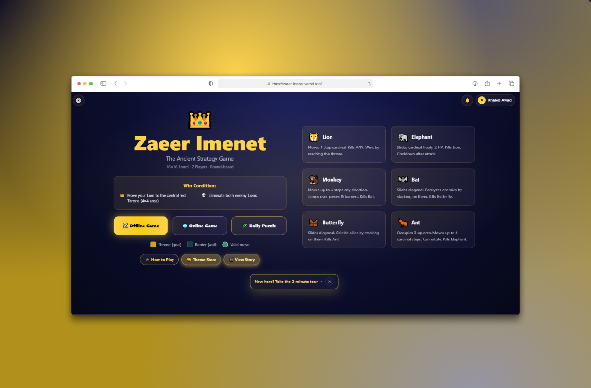
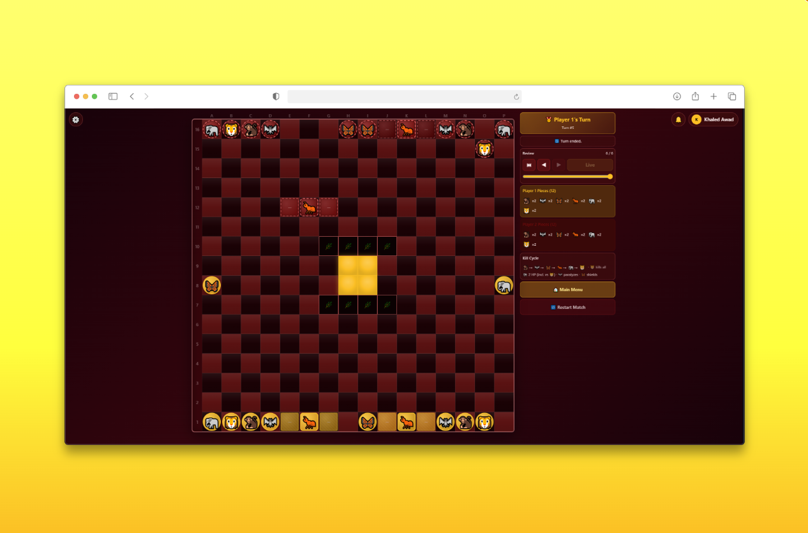
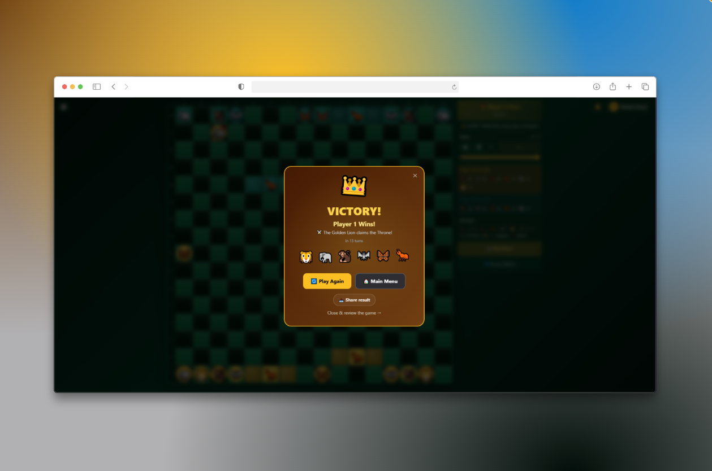

# Zaeer Imenet – Strategy Game

[](https://github.com/kelsaeed/ZAEER_IMENET/actions/workflows/ci.yml)
[](https://nextjs.org/)
[](https://www.typescriptlang.org/)
[](https://supabase.com/)
[](#testing--ci)
[](./LICENSE)



## Overview
Zaeer is an original turn-based strategy game built on a custom-designed system. The project combines game design, system architecture, and full-stack development into a single interactive platform.

The goal was to create a deterministic and balanced system where each piece has a defined role, interaction rules, and strategic value.

---

## Engineering Highlights

> A production-style, full-stack TypeScript game — not a tutorial clone.

- **Server-authoritative multiplayer** — every online move is re-validated by the pure game engine on the server before it's persisted, so a tampered client can't make an illegal move. The game state is the source of truth, not the browser.
- **Real-time sync** over Supabase Realtime (WebSockets), with **optimistic UI updates** and server reconciliation.
- **PostgreSQL with Row-Level Security** and 19 versioned SQL migrations — table access is enforced at the database layer.
- **Rate limiting** on the move/action API (fixed-window, in-memory pre-filter + database layer, fail-open).
- **AI opponent running minimax in a Web Worker**, so the search never blocks the UI thread.
- **Pure, deterministic game engine** decoupled from React and covered by **135 unit tests** (Node's built-in runner), gated in **CI**.
- **Custom React hooks** isolate engine/session/online logic from presentation (`useGame`, `useOnlineGame`, `usePuzzleSession`, `useProfileForm`).
- **Performance-tuned rendering** — a memoized 256-cell board, code-split heavy chunks, and CSS-keyframe animations instead of per-frame JS.
- **Internationalized (English / Arabic) with full RTL support.**

See **[ARCHITECTURE.md](./ARCHITECTURE.md)** for the system design and the online move flow.

---

## Game Preview






---

## Game Concept
- Board: 16×16 grid  
- Players: 2  
- Pieces: 6 types (12 per player)  

Victory is achieved by:
- Eliminating both enemy Lions  
- Or reaching the central throne  

The system is based on a structured interaction model between pieces, where each unit has specific movement, behavior, and combat rules.

---

## Core Mechanics
- Life-cycle based combat system  
- Multi-tile pieces with rotation (Ant)  
- Layer mechanics (shielding, disabling)  
- Strategic positioning over randomness  
- Turn-based deterministic gameplay  

---

## Piece System
- Lion: Primary unit, direct elimination  
- Elephant: High durability, conditional attacks  
- Monkey: High mobility, can jump obstacles  
- Bat: Disables enemy pieces  
- Butterfly: Shields allies  
- Ant: Multi-cell piece with rotation mechanics  

---

## Game Modes

### Local (Pass-and-Play)
Two players share one device and take turns on the same board.

### Vs AI
Single-player mode against a built-in computer opponent.
- Rule-aware engine that understands every piece's full move set, including Ant rotation, Bat disables, and Butterfly shielding
- Evaluates threats and protects its own Lions instead of trading them blindly
- Plays through your own pieces where the rules allow (e.g. attacking through a friendly Bat)
- Tuned to avoid forced losses and to keep games competitive into the late game

### Online Multiplayer
Real-time matches against other players, powered by Supabase.
- Public matchmaking and private share-link games
- Real-time board sync with low-latency turn updates
- Resign and rematch flow, plus a dismissable victory screen
- ELO rating that updates after each ranked match
- Defeat screen and post-game review with a history scrubber

---

## Social Features
- Accounts with email sign-in, password reset, and editable usernames
- Profile pages with avatars, stats, share-link card, and a friends preview
- Fuzzy friend search and friend requests
- Tap an opponent in a match to add as friend, block, mute, or view profile
- In-match chat plus direct messages between friends (RTL-aware)
- Real-time notification bell for friend requests and unread DMs
- Admin-only translations and Arabic title support

---

## Technical Implementation

### Frontend
- Next.js (App Router) + React + TypeScript
- Component-based architecture with a state-driven UI
- Tailwind CSS for styling
- Responsive layout tuned for both desktop and mobile (touch input, RAF-throttled resize, board scaling)

### Backend / Online
- Supabase (Postgres, Auth, Realtime, Storage)
- Row-Level Security policies for matches, friends, chat, and profiles
- Realtime channels for board state, chat, and notifications
- Avatar storage and share-link routing

### Game Engine
- Deterministic rule validation engine (no randomness)
- Turn system with move/attack locking
- Built-in AI opponent (`src/game/ai.ts`)
- Separation between UI components and the core game logic

---

## Architecture Focus
- Separation between UI and game engine  
- Deterministic logic (no randomness)  
- Scalable state handling  
- Extensible rule system  
- Clear split between local, AI, and online flows so each mode reuses the same core engine

---

## Tech Stack

| Layer | Technology |
| --- | --- |
| Language | TypeScript (strict mode) |
| Framework | Next.js 14 (App Router), React 18 |
| Styling | Tailwind CSS |
| Backend | Supabase — PostgreSQL, Auth, Realtime, Storage |
| Database | PostgreSQL with Row-Level Security + versioned SQL migrations |
| AI | Minimax search in a Web Worker |
| Tooling | ESLint, Prettier, Node test runner, GitHub Actions CI |

---

## Getting Started

```bash
npm install
npm run dev
```

Full environment setup — Supabase project, environment variables, database migrations, and the admin seed — is documented in **[SETUP.md](./SETUP.md)**. Copy `.env.example` to `.env.local` and fill in your Supabase keys.

| Script | Purpose |
| --- | --- |
| `npm run dev` | Start the development server |
| `npm run build` | Production build |
| `npm test` | Run the engine / AI / online-action test suite |
| `npm run typecheck` | Type-check without emitting |
| `npm run lint` | Lint with ESLint |
| `npm run format` | Format with Prettier |

---

## Testing & CI

- **135 unit tests** over the pure game engine, AI, the online-action trust boundary, and the rate limiter — run with Node's built-in test runner (`npm test`).
- **GitHub Actions CI** runs typecheck, the full test suite, and a production build on every push and pull request.
- **Linting** is enforced locally via a pre-commit hook (husky + lint-staged) and `npm run lint`.
- The server-authoritative move path trusts the engine, so keeping the engine green is an integrity guarantee, not just a quality one.

---

## Status
Active development. Local, AI, and online multiplayer modes are all playable, with ongoing polish to AI behavior, UI responsiveness, and edge-case rule handling.

---

## Intellectual Property
The game concept and design are officially registered as an intellectual work.

---

## Notes
This project focuses on building a complete system—from idea and rule design to full implementation—rather than isolated features.
