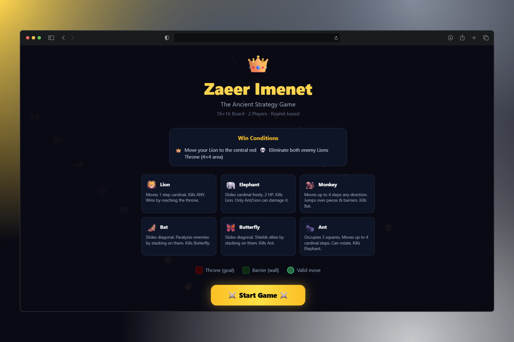
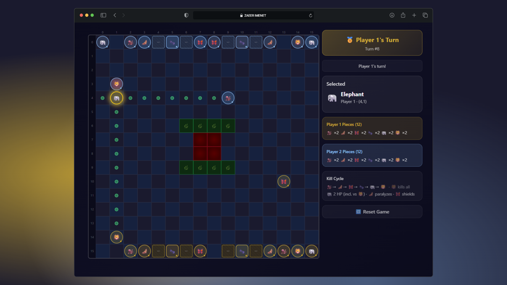
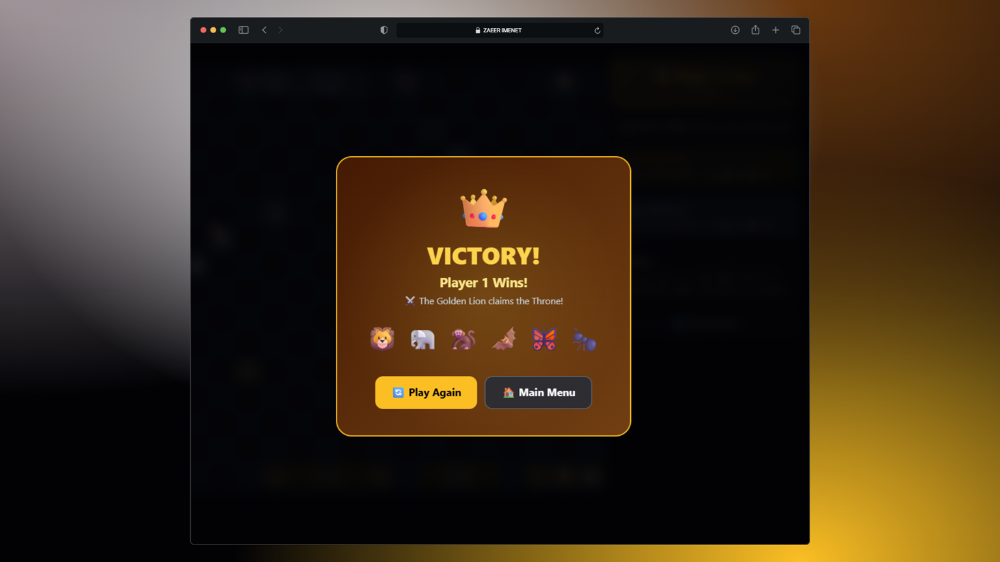
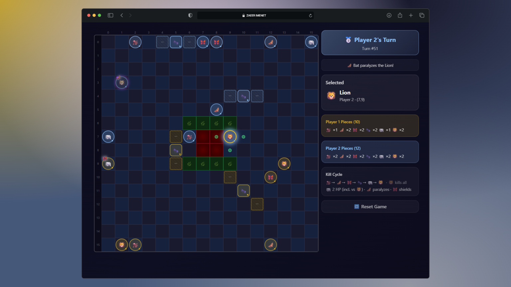

# Zaeer Imenet – Strategy Game

## Overview
Zaeer is an original turn-based strategy game built on a custom-designed system. The project combines game design, system architecture, and full-stack development into a single interactive platform.

The goal was to create a deterministic and balanced system where each piece has a defined role, interaction rules, and strategic value.

---

## Game Preview

---

## Game Concept
- Board: 16×16 grid  
- Players: 2  
- Pieces: 6 types (12 per player)  

Victory is achieved by:
- Eliminating both enemy Lions  
- Or reaching the central throne  

The system is based on a structured interaction model between pieces, where each unit has specific movement, behavior, and combat rules.

---

## Core Mechanics
- Life-cycle based combat system  
- Multi-tile pieces with rotation (Ant)  
- Layer mechanics (shielding, disabling)  
- Strategic positioning over randomness  
- Turn-based deterministic gameplay  

---

## Piece System
- Lion: Primary unit, direct elimination  
- Elephant: High durability, conditional attacks  
- Monkey: High mobility, can jump obstacles  
- Bat: Disables enemy pieces  
- Butterfly: Shields allies  
- Ant: Multi-cell piece with rotation mechanics  

---

## Game Modes

### Local (Pass-and-Play)
Two players share one device and take turns on the same board.

### Vs AI
Single-player mode against a built-in computer opponent.
- Rule-aware engine that understands every piece's full move set, including Ant rotation, Bat disables, and Butterfly shielding
- Evaluates threats and protects its own Lions instead of trading them blindly
- Plays through your own pieces where the rules allow (e.g. attacking through a friendly Bat)
- Tuned to avoid forced losses and to keep games competitive into the late game

### Online Multiplayer
Real-time matches against other players, powered by Supabase.
- Public matchmaking and private share-link games
- Real-time board sync with low-latency turn updates
- Resign and rematch flow, plus a dismissable victory screen
- ELO rating that updates after each ranked match
- Defeat screen and post-game review with a history scrubber

---

## Social Features
- Accounts with email sign-in, password reset, and editable usernames
- Profile pages with avatars, stats, share-link card, and a friends preview
- Fuzzy friend search and friend requests
- Tap an opponent in a match to add as friend, block, mute, or view profile
- In-match chat plus direct messages between friends (RTL-aware)
- Real-time notification bell for friend requests and unread DMs
- Admin-only translations and Arabic title support

---

## Technical Implementation

### Frontend
- Next.js (App Router) + React + TypeScript
- Component-based architecture with a state-driven UI
- Tailwind CSS for styling
- Responsive layout tuned for both desktop and mobile (touch input, RAF-throttled resize, board scaling)

### Backend / Online
- Supabase (Postgres, Auth, Realtime, Storage)
- Row-Level Security policies for matches, friends, chat, and profiles
- Realtime channels for board state, chat, and notifications
- Avatar storage and share-link routing

### Game Engine
- Deterministic rule validation engine (no randomness)
- Turn system with move/attack locking
- Built-in AI opponent (`src/game/ai.ts`)
- Separation between UI components and the core game logic

---

## Architecture Focus
- Separation between UI and game engine  
- Deterministic logic (no randomness)  
- Scalable state handling  
- Extensible rule system  
- Clear split between local, AI, and online flows so each mode reuses the same core engine

---

## Status
Active development. Local, AI, and online multiplayer modes are all playable, with ongoing polish to AI behavior, UI responsiveness, and edge-case rule handling.

---

## Intellectual Property
The game concept and design are officially registered as an intellectual work.

---

## Notes
This project focuses on building a complete system—from idea and rule design to full implementation—rather than isolated features.
